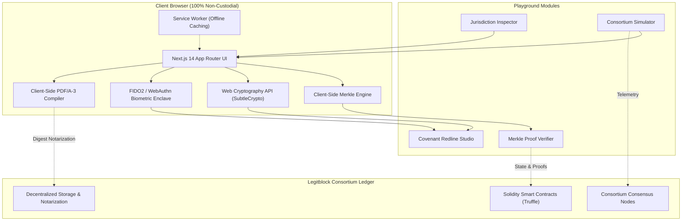

# Legitblock Web Platform & Documentation Hub

[](https://github.com/Legitblock/legitblock.github.io/actions/workflows/ci.yml)
[](https://github.com/Legitblock/legitblock.github.io/actions/workflows/deploy.yml)
[](https://nextjs.org/)
[](https://www.typescriptlang.org/)
[](https://tailwindcss.com/)
[](https://opensource.org/licenses/MIT)

> **Legitblock** is an enterprise-grade smart legal contract and decentralized consortium verification platform. It bridges statutory commercial law with cryptographic guarantees, enabling non-custodial multi-jurisdictional contract execution, granular Merkle-tree clause validation, statutory PDF/A-3 compilation, and WebAuthn hardware-backed passkey signing.

This repository (`legitblock.github.io`) hosts the official web application, documentation center, and interactive client-side cryptographic playground, deployed directly to GitHub Pages at [legitblock.github.io](https://legitblock.github.io).

---

## 🌟 Key Capabilities & Architectural Highlights

### 1. 🛡️ Interactive Cryptographic Legal-Tech Playground (`/playground`)
- **Merkle Clause Inspector & Proof Verifier**: Deconstructs legal contracts into cryptographic leaf clauses, computes SHA-256 Merkle roots, and allows interactive real-time verification of Merkle inclusion proofs (`auditPath`) with single-clause tamper simulations.
- **Statutory PDF/A-3 Generator**: Generates ISO 19005-3 compliant PDF documents embedding machine-readable JSON metadata, cryptographic hashes, and statutory recitals entirely client-side.
- **Dynamic Covenant Studio & Visual Redline Editor**: Real-time visual diffing (green insertions / red strikethroughs) between contract revisions, dynamic threshold sliders (e.g., EBITDA limits, leverage ratios), and instant Merkle root re-computation.
- **Consortium Consensus Simulator**: Simulates multi-party consortium governance across enterprise nodes (Enterprise, Regulatory, Auditor, Escrow) with dynamic Byzantine Fault Tolerance (BFT) quorum calculations, gas estimation, and latency telemetry.
- **Hardware-Backed WebAuthn Passkeys**: Authenticates and cryptographically signs contractual manifests using FIDO2 / TouchID / FaceID / YubiKey hardware enclaves, with automated fallback to W3C Web Cryptography API (`crypto.subtle`) for environments without WebAuthn hardware.
- **State Replay & Chain Validator**: Step-through deterministic state replay of contract lifecycles, auditing block confirmations, gas limits, and cryptographic state transitions.

### 2. ⚖️ Multi-Jurisdiction Compliance Inspector
Provides real-time statutory enforceability audits across major legal jurisdictions:
- **United States (Delaware)**: DGCL § 224 (electronic books and records) and DGCL § 219(c).
- **United States (Wyoming)**: Decentralized Autonomous Organization Supplement (W.S. § 17-31).
- **United Kingdom**: Law Commission Electronic Trade Documents Act 2023 & smart contract enforceability guidelines.
- **European Union**: eIDAS Regulation (EU No 910/2014) and Qualified Electronic Signatures (QES) / EBSI compatibility.
- **Singapore**: Electronic Transactions Act 2021 (ETA Part IIB - UNCITRAL Model Law on Electronic Transferable Records / MLETR).

### 3. 🌐 Offline-First Progressive Web App (PWA)
- **Zero-Knowledge / Non-Custodial**: Plaintext agreements and private keys never leave the browser. All SHA-256 hashing, Merkle calculations, and signature verifications occur 100% client-side.
- **Service Worker Caching**: Full offline functionality for cryptographic inspection, proof verification, and documentation navigation via custom cache-first and stale-while-revalidate strategies.

### 4. 📚 Comprehensive Developer & Legal Reference Hub
- **Architecture Deep-Dive (`/architecture`)**: System component interactions, ledger topology, and smart contract abstractions.
- **Core Library Guide (`/core-library`)**: TypeScript API definitions and npm integration guide for `@legitblock/core`.
- **CLI Reference (`/cli`)**: Command-line interface manual for contract compilation, notarization, and verification.
- **Smart Contract Reference (`/api-reference`)**: Solidity interface signatures, events, and gas optimization profiles.
- **Legal Justification (`/why-blockchain`)**: Comparative analysis contrasting traditional centralized escrow, legal registries, and cryptographic ledgers.
- **Template Catalog (`/templates`)**: Ready-to-deploy standardized legal contract templates (Supply Chain, Tokenized Real Estate, Multi-Sig Escrow, Consortium Charter).

---

## 🏛️ System Architecture



---

## 📂 Repository Structure

```
legitblock.github.io/
├── .github/
│   └── workflows/
│       ├── ci.yml                 # Automated testing, type checking, and static build verification
│       └── deploy.yml             # Zero-downtime GitHub Pages deployment workflow
├── docs/
│   ├── ARCHITECTURE.md            # Detailed technical and cryptographic architecture
│   ├── PLAYGROUND_GUIDE.md        # Walkthrough of interactive tools and playground modules
│   ├── JURISDICTIONS.md           # Legal statutes and jurisdictional enforceability analysis
│   ├── CONTRIBUTING.md            # Developer guidelines, branch strategy, and PR workflow
│   └── SECURITY.md                # Security policy, threat model, and cryptographic disclosure
├── public/
│   ├── sw.js                      # Progressive Web App offline caching Service Worker
│   ├── manifest.json              # Web App manifest (standalone PWA configuration)
│   └── icons/                     # Application icons and branding assets
├── src/
│   ├── app/                       # Next.js 14 App Router routes & layout
│   │   ├── layout.tsx             # Root layout with theme provider and service worker registration
│   │   ├── page.tsx               # Homepage with feature matrix and dynamic metrics
│   │   ├── playground/            # Interactive Legal-Tech Playground
│   │   ├── templates/             # Contract templates and clause wizard
│   │   ├── architecture/          # Architecture documentation page
│   │   ├── core-library/          # Core TypeScript SDK reference
│   │   ├── cli/                   # Legitblock CLI guide
│   │   ├── api-reference/         # Solidity smart contract API reference
│   │   ├── why-blockchain/        # Statutory legal and technological justification
│   │   └── globals.css            # Tailwind CSS directives and custom theme variables
│   ├── components/                # Modular React UI and interactive cryptographic widgets
│   │   ├── MerkleProofVerifier.tsx       # Interactive Merkle leaf/root inspector & proof generator
│   │   ├── StatutoryPdfGenerator.tsx     # Client-side ISO 19005-3 PDF/A generator
│   │   ├── CovenantStudio.tsx            # Dynamic financial covenant threshold editor & redline
│   │   ├── ConsortiumSimulator.tsx       # BFT multi-node consensus & telemetry simulator
│   │   ├── JurisdictionInspector.tsx     # Multi-jurisdictional legal compliance checker
│   │   ├── InteractiveChainSimulator.tsx # Deterministic blockchain block progression engine
│   │   ├── ChainValidatorTool.tsx        # Cryptographic chain integrity auditor
│   │   ├── VisualRedlineEditor.tsx       # Clause redline diff engine
│   │   ├── ScenarioSimulator.tsx         # Business scenario stress tester
│   │   ├── TemplateCatalog.tsx           # Contract template browser and exporter
│   │   ├── TemplateWizard.tsx            # Guided contract parameter customizer
│   │   ├── ThemeChooser.tsx              # Dark/Light/Cyberpunk/Consortium theme switcher
│   │   ├── TerminalDemo.tsx              # Interactive CLI emulator
│   │   ├── Header.tsx                    # Main navigation bar with active route highlighting
│   │   ├── Footer.tsx                    # Site footer with legal and GitHub links
│   │   ├── Sidebar.tsx                   # Docs sidebar navigation
│   │   └── CodeBlock.tsx                 # Syntax-highlighted code block with copy action
│   ├── content/
│   │   └── templateData.ts        # Pre-configured legal contract templates and clauses
│   └── lib/
│       └── navigation.ts          # Centralized route definitions and navigation metadata
├── next.config.mjs                # Next.js configuration (static export, unoptimized images)
├── tailwind.config.js             # Tailwind CSS theme extensions and color palettes
├── tsconfig.json                  # Strict TypeScript configuration
└── package.json                   # Dependencies and npm scripts
```

---

## 🚀 Quick Start & Local Development

### Prerequisites
- **Node.js**: `v20.x` or `v22.x` (LTS recommended)
- **pnpm**: `v9.x` or higher (`corepack enable && corepack prepare pnpm@latest --activate`)

### Installation
1. Clone the repository:
   ```bash
   git clone git@github.com:Legitblock/legitblock.github.io.git
   cd legitblock.github.io
   ```

2. Install dependencies:
   ```bash
   pnpm install
   ```

### Development Server
Start the local development server:
```bash
pnpm dev
```
Open [http://localhost:3001](http://localhost:3001) in your browser to inspect the application.

### Type Checking & Validation
Run strict TypeScript static analysis:
```bash
pnpm typecheck
```

### Production Build & Static Export
Compile and export the production static site:
```bash
pnpm build
```
The optimized static HTML, CSS, JavaScript, and asset bundles will be emitted to `./out/`.

You can preview the production export locally:
```bash
pnpm start
# or serve directly
npx serve out
```

---

## 🔄 CI/CD & Deployment Pipeline

This repository uses automated GitHub Actions workflows for continuous integration and delivery:

1. **Continuous Integration (`.github/workflows/ci.yml`)**:
   - Triggers on every pull request to `master` and pushes to feature branches.
   - **Typecheck Job**: Executes `pnpm typecheck` under strict compiler flags.
   - **Build Verification Job**: Compiles Next.js with static export to ensure all 12 routes render without errors, verifies output bundle structure, and ensures zero broken page references.
   - **Security Audit Job**: Checks dependency trees for known vulnerabilities.

2. **Continuous Deployment (`.github/workflows/deploy.yml`)**:
   - Triggers automatically upon merging or pushing to `master` (and via manual `workflow_dispatch`).
   - Runs validation and static export with GitHub Pages base path configuration.
   - Publishes the generated `./out` artifact directly to GitHub Pages.

---

## 🔒 Security Model & Non-Custodial Principles

- **Zero Server Plaintext**: All contract drafting, parameter modification, Merkle leaf computation, and signature generations occur inside the client browser. No contractual text or private keys are transmitted to any server.
- **Hardware Isolation**: When signing with WebAuthn, private keys never leave the device's hardware Secure Enclave or FIDO2 authenticator.
- **SubtleCrypto Cryptographic Primitive**: SHA-256 operations use native hardware acceleration via the browser's W3C `crypto.subtle` API.
- For complete security disclosures and threat modeling, review [docs/SECURITY.md](docs/SECURITY.md).

---

## 🤝 Monorepo Ecosystem

`legitblock.github.io` is part of the broader Legitblock suite:
- **`legitblock/legitblock`**: Core Solidity smart contracts, Truffle migration scripts, and 100% passing contract test suites.
- **`legitblock/legitblock.github.io`**: This web application, interactive playground, and documentation portal.
- **`legitblock/legitblock-impressJS`**: Presentation decks and slide deck visualizers.

---

## 📖 Further Documentation

- 📐 [Detailed Architecture Guide](docs/ARCHITECTURE.md)
- 🎮 [Playground & Cryptographic Tools Guide](docs/PLAYGROUND_GUIDE.md)
- ⚖️ [Jurisdictional Legal Frameworks](docs/JURISDICTIONS.md)
- 💻 [Contributing Guidelines](docs/CONTRIBUTING.md)
- 🔐 [Security & Cryptography Disclosure](docs/SECURITY.md)

---

## 📄 License

This project is licensed under the [MIT License](LICENSE).
