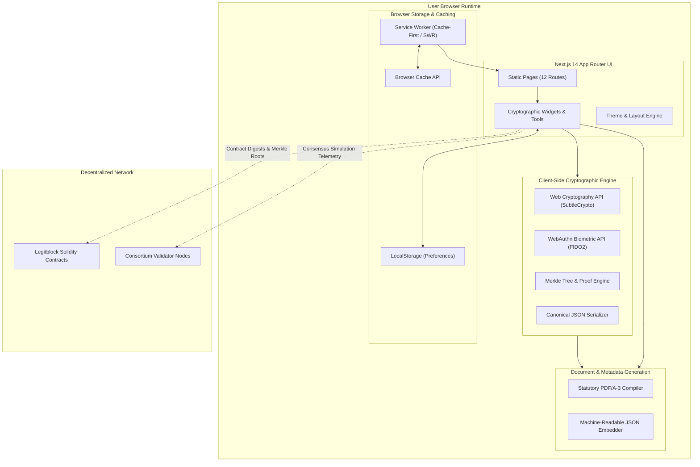

# Legitblock Web Platform Architecture

This document provides a comprehensive technical breakdown of the architecture, data flows, cryptographic primitives, and state management of the `legitblock.github.io` web platform and interactive legal-tech playground.

---

## 1. Architectural Philosophy

Legitblock bridges traditional statutory legal frameworks with decentralized cryptographic consensus. The web application adheres to four foundational design tenets:

1. **Strict Client-Side Sovereignty (Zero Plaintext Transmission)**: Plaintext agreements, confidential financial covenants, and private keys never leave the user's browser. All cryptographic operations—including hashing, Merkle tree synthesis, signature verification, and PDF compilation—are computed in-browser.
2. **Deterministic Prerendering & Static Delivery**: The entire portal compiles down to static HTML5/CSS/JavaScript and is distributed globally via GitHub Pages with zero required backend servers.
3. **Hardware-Anchored Authentication**: Contractual approvals are cryptographically bound using WebAuthn / FIDO2 authenticators (TouchID, FaceID, YubiKeys), rooting legal assent in tamper-resistant secure hardware enclaves.
4. **Offline Resilience**: A custom Service Worker caches critical assets, route payloads, and cryptographic verification routines, enabling offline validation of legal instruments.

---

## 2. System Architecture Diagram



---

## 3. Cryptographic Pipeline

### 3.1. Canonical Serialization
To guarantee deterministic hashing across varying browser engines and JSON stringification quirks, all contract metadata and clauses pass through a canonical serializer:
1. Object keys are sorted lexicographically (`Object.keys().sort()`).
2. Whitespace is strictly normalized.
3. Numeric representations avoid floating-point drift.
4. Output is encoded to a binary `Uint8Array` via `TextEncoder('utf-8')`.

### 3.2. SHA-256 Merkle Tree Construction
Contracts are decomposed into discrete, legally binding clauses (e.g., *Jurisdiction*, *Consideration*, *Covenants*, *Arbitration*). Each clause is treated as an individual leaf node in a balanced binary Merkle tree:

$$H_{\text{leaf}} = \text{SHA-256}(\text{CanonicalClauseContent})$$

The Merkle tree generation pipeline:
1. **Leaf Hashing**: Every clause is hashed using native `window.crypto.subtle.digest('SHA-256', ...)`. A synchronous pure-JS SHA-256 implementation serves as an automated fallback for environments without `window.crypto`.
2. **Pairwise Combining**: Adjacent leaves are paired and concatenated:
   $$H_{\text{parent}} = \text{SHA-256}(H_{\text{left}} \mathbin{\Vert} H_{\text{right}})$$
   If an odd number of nodes exists at a given tree level, the final node is duplicated to maintain balance.
3. **Root Synthesis**: The process recurses upward until a single 32-byte (64 hex character) Merkle Root is obtained.

### 3.3. Merkle Inclusion Proofs (`auditPath`)
To prove that a specific clause belongs to an authorized contract without disclosing the contents of unrelated clauses, the system generates a Merkle audit path:
- An ordered array of sibling hashes and positional indicators (`'left'` or `'right'`).
- Verification computes upward from the target clause hash using the sibling hashes. If the computed root matches the known contract Merkle root, the clause is proved authentic:

$$\text{Root}_{\text{computed}} \stackrel{?}{=} \text{Root}_{\text{contract}}$$

```mermaid
sequenceDiagram
    participant User as Signer / Auditor
    participant UI as MerkleProofVerifier
    participant Crypto as SubtleCrypto Engine
    participant Ledger as Blockchain Contract

    User->>UI: Select Target Clause (e.g. Clause #2)
    UI->>Crypto: Compute Hash(Clause #2)
    Crypto-->>UI: Leaf Hash (h2)
    UI->>Crypto: Collect Siblings [h1 (left), h34 (right)]
    Crypto-->>UI: Audit Path Array
    UI->>Crypto: Hash(h1 || h2) -> h12; Hash(h12 || h34) -> Root
    Crypto-->>UI: Calculated Merkle Root
    UI->>Ledger: Compare with Notarized Root
    Ledger-->>UI: Match Confirmed (Valid)
    UI-->>User: Green "Cryptographically Valid" Badge
```

---

## 4. Hardware WebAuthn Integration

Legitblock incorporates W3C Web Authentication (WebAuthn / FIDO2) to replace vulnerable software-held private keys with hardware-isolated credentials:

1. **Credential Generation (`navigator.credentials.create`)**:
   - Uses `publicKey` credential options with `ES256` (ECDSA over NIST P-256) or `RS256`.
   - Requires user verification (`userVerification: 'preferred'`), triggering TouchID, FaceID, or physical security key taps.
2. **Contract Manifest Signing (`navigator.credentials.get`)**:
   - The contract's Merkle root is supplied as the cryptographic `challenge`.
   - The hardware authenticator signs the client data hash with its enclave-protected private key.
   - The returned `authenticatorData` and `signature` provide non-repudiation rooted in physical hardware.
3. **Graceful Fallback**: If WebAuthn is unavailable or rejected by the platform, the platform falls back to ECDSA / HMAC using SubtleCrypto, logging a clear advisory to the user.

---

## 5. Client-Side Statutory PDF/A-3 Generator

Legitblock implements an in-browser PDF compiler adhering to the **ISO 19005-3 (PDF/A-3)** specification for long-term legal archival:

1. **PDF Object Graph**: Constructs valid low-level PDF syntax (Catalog, Pages, Page, Font, Content Stream) with deterministic byte offsets.
2. **Cross-Reference Table (`xref`)**: Calculates precise byte positions for all objects to satisfy strict statutory PDF validators and judicial e-filing systems.
3. **Embedded Machine-Readable Payload**: Embeds a canonical JSON representation containing:
   - Contract ID and human-readable title.
   - Exact Merkle Root (`0x...`).
   - Per-clause SHA-256 hashes.
   - Jurisdictional recitals (DGCL, eIDAS, MLETR).
   - Timestamp and signing party public keys.
4. **Binary Blob Delivery**: Compiles the document stream into an `application/pdf` Blob and triggers a zero-network local file download.

---

## 6. Multi-Jurisdiction Legal Rule Engine

The `JurisdictionInspector` component evaluates agreements against statutory codifications:

| Jurisdiction | Statute | Statutory Requirement | Legitblock Technical Enforcement |
|:---|:---|:---|:---|
| **Delaware, USA** | DGCL § 224 | Books and records in digital/distributed ledger format | Cryptographic Merkle tree clause representation; deterministic export |
| **Wyoming, USA** | W.S. § 17-31 | Decentralized Autonomous Organization governance recognition | Multi-sig quorum consensus and algorithmic smart contract voting |
| **United Kingdom** | Law Commission 2023 / ETDA | Electronic transferable records; control & possession test | Unique cryptographic leaf ownership; Merkle inclusion proofs |
| **European Union** | eIDAS (EU 910/2014) / eIDAS 2.0 | Electronic seals and Qualified Electronic Signatures (QES) | WebAuthn hardware passkeys; SHA-256 digest notarization |
| **Singapore** | ETA 2021 Part IIB (MLETR) | Transferable electronic records integrity guarantee | Immutably linked chain blocks; complete state transition history |

---

## 7. Progressive Web App (PWA) & Offline Runtime

- **Service Worker (`public/sw.js`)**:
  - Intercepts fetch events across the domain.
  - Employs a **Cache-First** strategy for immutable Next.js static chunks (`/_next/static/*`) and assets.
  - Employs a **Stale-While-Revalidate (SWR)** strategy for HTML routes.
  - Operates completely client-side without relying on remote API calls for cryptographic validation.
- **Manifest (`public/manifest.json`)**: Configured for standalone window mode with dark/light adaptive icons and legal document mime-type registrations.

---

## 8. Integration with Legitblock Smart Contracts

The web client interfaces with the core `legitblock` Solidity smart contracts:
- `Legitblock.sol`: Manages contractual state machines, party notarization, and Merkle root anchoring.
- `LegalToken.sol`: ERC-20 / ERC-721 compliant asset-backed tokenization for covenants and performance escrows.

For smart contract technical details and Truffle test suites, see the companion repository at `legitblock/legitblock`.
